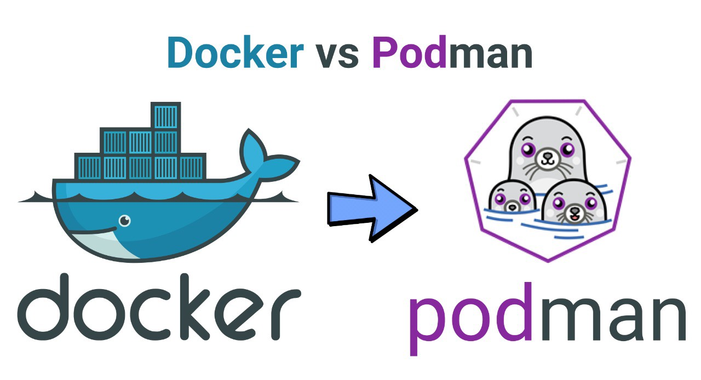

# DevOpsAndMore
Hello and Welcome ;-) This repository contains many useful materials and it will be filled bi-weekly.
Yuo can select interesting branch and checkout to it.
Note: PLease use markdown to format pages [Markdown Cheatsheet](https://github.com/adam-p/markdown-here/wiki/Markdown-Cheatsheet)

++++++++++++++++++++ Container tools ++++++++++++++++++++ 

1. Docker
2. Podman
3. [Docker vs Podman](https://developers.redhat.com/blog/2019/02/21/podman-and-buildah-for-docker-users/)
4. [Rootless containers](https://developers.redhat.com/blog/2020/09/25/rootless-containers-with-podman-the-basics/)
5. [Linux user namespaces(prepare your eyes...)](https://man7.org/linux/man-pages/man7/user_namespaces.7.html)

