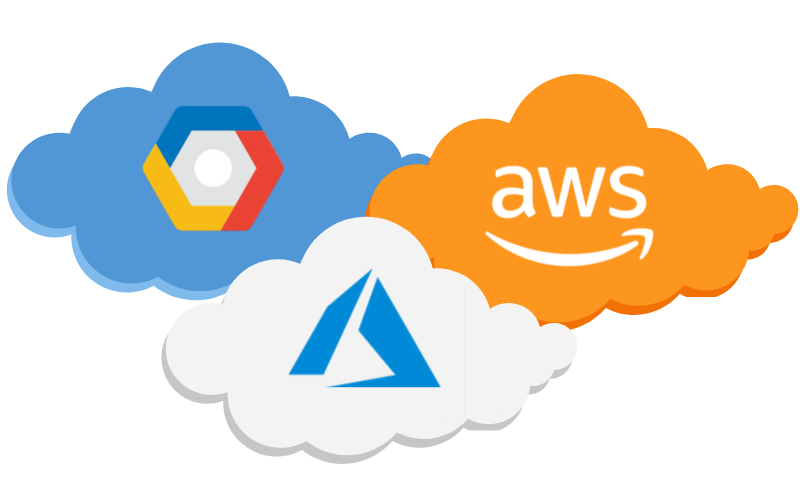

# DevOpsAndMore

++++++++++++++++++++ Cloud providers ++++++++++++++++++++ 

List of most popular cloud providers:
1. [Google Cloud Platform(GCP)](https://cloud.google.com)
2. [Amazon Web Services(AWS)](https://aws.amazon.com)

Learning:
[AWS Cloud Practitioner Essentials от AWS Training and Certification](https://www.aws.training/Details/eLearning?id=60697))
11 blocks avout AWS Cloud for beginners.
Duration:6 hours. 

3. [Microsoft Azure](https://azure.microsoft.com)

