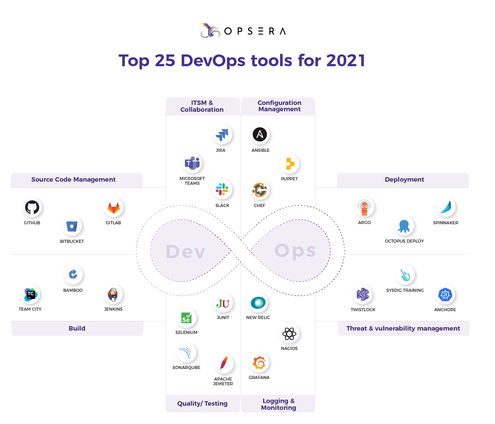

# DevOpsAndMore
Hello and Welcome ;-) This repository contains many useful materials for those who want to find almost all information about DevOps...
You can select interesting branch and checkout to it.
Note: Please use markdown to format pages [Markdown Cheatsheet](https://github.com/adam-p/markdown-here/wiki/Markdown-Cheatsheet)

++++++++++++++++++++ DevOpsAndMore ++++++++++++++++++++ 

Universe of modern cloud native tools --> [CNCF Cloud Native Interactive Landscape](https://landscape.cncf.io)

[Recommended Learning Path](https://github.com/sergei-voron/DevOpsAndMore/tree/Learnin-path)

List of themes and materials on the next several weeks
1. [Source-code-management](https://github.com/sergei-voron/DevOpsAndMore/tree/SCM)
2. [Monitoring](https://github.com/sergei-voron/DevOpsAndMore/tree/Monitoring)
4. [Software Development](https://github.com/sergei-voron/DevOpsAndMore/tree/Software-development)
    

    
    - [Code-writing-practices](https://github.com/DevOpsAndMore/DevOpsAndMore/blob/Code-writing-practices/README.md)
    Dev project: rest api getter/setter, templates. Maybe we should think about writing plugin/module
    

3. [Building tools maven/gradle](https://github.com/sergei-voron/DevOpsAndMore/tree/Building-tools)
4. [CI/CD servers](https://github.com/sergei-voron/DevOpsAndMore/tree/CI-CD)
5. [Artifact repository managers](https://github.com/sergei-voron/DevOpsAndMore/tree/Artifact-repository-managers)
6. [Orchestration tools](https://github.com/sergei-voron/DevOpsAndMore/tree/Orchestration-tools)
7. [Container tools:docker/podman](https://github.com/sergei-voron/DevOpsAndMore/tree/Container-tools)
8. [Message brokers](https://github.com/sergei-voron/DevOpsAndMore/tree/Message-brokers)
9. [Cloud providers](https://github.com/sergei-voron/DevOpsAndMore/tree/Cloud-providers)
10. [Quality Assurance](https://github.com/sergei-voron/DevOpsAndMore/tree/QA)
    Test frameworks. Base theory, principles and best practices
12. [SDLC](https://github.com/sergei-voron/DevOpsAndMore/tree/SDLC)
    

    
    - Waterfall
    - Agile
    - Lean
    - Iterative
    - Prototyping
    - DevOps
    - Spiral 
    - V-model
    

14. [Databases](https://github.com/sergei-voron/DevOpsAndMore/tree/Databases)
    

    
    - SQL 
    - NoSQL
    

16. [Software Architecture](https://github.com/sergei-voron/DevOpsAndMore/tree/Software-Architeture) 
    

    
    - Miscroservices 
    - Monolith
    

18. [Best-practices](https://github.com/sergei-voron/DevOpsAndMore/tree/Best-practices)
19. [Service mesh](https://github.com/sergei-voron/DevOpsAndMore/tree/Service-mesh)
20. [Job interview](https://github.com/sergei-voron/DevOpsAndMore/tree/Job-interview)
    

    - [Code-writing-practices](https://github.com/DevOpsAndMore/DevOpsAndMore/blob/Code-writing-practices/README.md)
    

22. [Code Analyzers](https://github.com/sergei-voron/DevOpsAndMore/tree/Code-analyzers)
    

    
    - SonarQube
    - ESLint
    - Xray
    
    
23. [Troubleshooting](https://github.com/sergei-voron/DevOpsAndMore/tree/Troubleshooting)
    

    
    - Methodologies 
    - Log parsing in microservice architecture
    

24. [Performance](https://github.com/sergei-voron/DevOpsAndMore/tree/Performance)
    

    
    - Profiling
    

25. Definition of Skills Proficiency
    

    
    - **Novice** (You have a common knowledge or an understanding of basic techniques and concepts)
    - **Developing** (You have the level of experience gained in a classroom and/or experimental scenarios or as a trainee on-the-job. You are expected to need help when performing this skill)
    - **Intermediate** (You are able to successfully complete tasks in this competency as Help from someone who is advanced/expert may be required from time to time, but you can usually perform the skill independently)
    - **Advanced** (You can perform the actions associated with this skill without assistance. You are certainly recognized within your immediate organization as "a person to ask" when difficult questions arise regarding this skill)
    - **Expert** (You are known as an expert in this area. You can provide guidance, troubleshoot, and answer questions related to this area of expertise and the field where the skill is used)
    - **Distinguished** (You are known organization-wide as a recognized expert in this area. You are sought out to provide guidance to employees with basic to expert knowledge in this area)
    

26. [Best-practices](https://github.com/sergei-voron/DevOpsAndMore/tree/Release-management)
    

    - [Semantic versioning](https://semver.org/)
    

1. [Top 25 devops tools that you need to know](https://www.opsera.io/blog/top-25-devops-tools-that-you-need-to-know)
2. [Ci/cd tools](https://www.katalon.com/resources-center/blog/ci-cd-tools)
