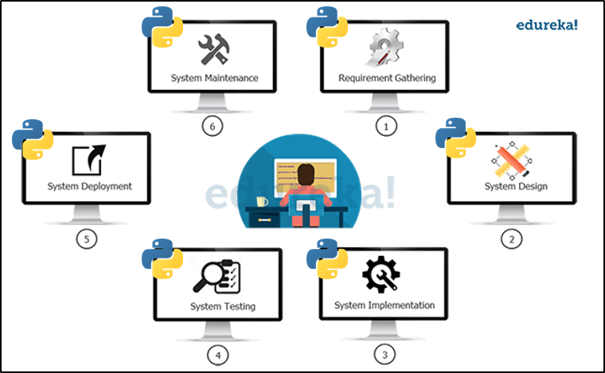

++++++++++++++++++++ Python ++++++++++++++++++++

**Why do we need to use Python for DevOps?**

	
- Python with its programming friendly and vast libraries makes automation very easy. That is why it is used in DevOps and has become the de facto language for the automation of the DevOps. 

        It is a great scripting language used for automation. Many tools such as Saltstack and Ansible are written in Python. 
        It is also used for complete infrastructure automation and orchestration. To debug and code it is far ahead than Ruby. 
        It is a very agile programming language and it takes a direct approach to program and simplicity is invaluable to DevOps. 
        Its vast libraries for DevOps toolsets are preferred when compared to others because of its ease of access and flexibility. 
        Not only in DevOps, but it is also used in various applications such as Machine Learning, AI, IoT, and Data Science. 
        Learn DevOps online that covers the principles of DevOps, tools used in DevOps, and Python Programming 

- Best way to use python for DevOps
You can do anything in DevOps using python. The main areas are the automation of the DevOps life cycle management using Python. The CI/CD pipeline can be automated using Python. The best ways to use Python for DevOps are as follows,

        Automate the DevOps life cycle management
        Automate the infrastructure deployment and configuration management
        Use Python to modify, configure and automate the tools used in DevOps
        Use Python for the CI/CD pipeline automation
        Python as a script can be used for automating the small day to day checking and monitoring tasks 
        Deploy applications automatically from Dev to QA to Prod environment
        Ensure that DevOps applications are platform-independent by smart and simple programming using Python.
        Automate the operational tasks of the sysadmin which is repetitive and periodic.
        Manage and control the infrastructures using Python programming and using tools

Books for beginners:

  
1. A bite of Python

- Visit https://github.com/swaroopch/byte-of-python/releases/latest to download a PDF file (best for desktop reading) or an EPUB file (best for devices such as mobile, tablet, ebook readers).

- Visit https://github.com/swaroopch/byte-of-python for the raw content (for suggesting corrections, changes, translating, etc.)

Read the book in your native language
If you are interested in reading or contributing translations of this book to other human languages, please see Translations.

Books for DevOps:

	
[Python for DevOps](https://www.oreilly.com/library/view/python-for-devops/9781492057680/)

Most useful python modules for DevOps:

1. [Requests](https://pypi.org/project/requests)

This module allows you to send HTTP requests. Using this module, we can post or retrieve the data from a Rest API. There are many methods included in this module, like:

      GET
      POST
      PUT
      DELETE
All these methods perform particular actions like adding a comment (PUT), retrieving data (GET), or deleting a user field (DELETE).

    Example:  r = requests.get(“url”,auth=('username', 'passwd'))

In the above example, we used the request module to get the information from the URL provided. You can get information like status code, JSON data using status code() and json() methods, respectively.

2. [Paramiko](https://pypi.org/project/paramiko)

The Paramiko module allows users to log in to a virtual machine’s server using automation scripts. It enables the users to perform ad-hoc commands by using SSH client. All commands get executed in the connected remote machines.

      Example - ssh = paramiko.SSHClient()
                ssh.set_missing_host_key_policy(paramiko.AutoAddPolicy())
                ssh.connect(ip, username=user, password=passwd)
                stdin, stdout, stderr = ssh.exec_command("command")
                out = stdout.readlines()

In this example, we connected to a server using its I.P., username, and password. ‘stdin’ stores the input passed, ‘stdout’ stores the output obtained, and ‘stderr’ stores the error occurred.

3. [Pandas](https://pypi.org/project/pandas)

Pandas module is for data manipulation. It is the most useful module for data science engineers. But in DevOps, Pandas helps to store the massive dump of data into CSV or Excel files within seconds.

    Example - pandas.read_json("file.json").to_excel("output.xlsx")

In the above example, we used the read_json() method to read a JSON file and migrated its data into an Excel file.

4. [Selenium](https://pypi.org/project/selenium)

One of the most popular modules used in Python to perform testing and connect to different browsers. By using Selenium, we can hit a URL and perform actions like clicking on a button. We can even use other sub-modules like ‘Pyautogui’ with Selenium for different purposes, like filling some text fields.

    Example - from selenium import webdriver
              driver = webdriver.Chrome()
              driver.get("https://www.gspann.com")

In the above example, we have used Chrome WebDriver to access the Chrome browser. If you want to use this module for other browsers, you need to use different WebDrivers accordingly.

5. [BeautifulSoup](https://pypi.org/project/beautifulsoup4)

It is the most useful module in Python for pulling data from HTML and XML files. To parse data from the content in HTML and XML format, we need to create a BeautifulSoup object for it. We can then use the BeautifulSoup methods on the soup object that we created for the URL. We can even apply many filters using the tags on the obtained data content, like soup.find_all(“< tag>”).

    Example - URL = “https://www.gspann.com”
              content = urllib2.urlopen(url).read()
              soup = BeautifulSoup(content)

In this example, we are extracting all the content of the page into a soup variable. Using the soup variable, we can obtain the information of a specific tag by methods like find_all.

6. OS - Standard Library

This is the basic module used in python. It performs ad-hoc commands on the base OS, which we are executing. All commands run on the current machine.

    Example -  os.system(“dir”)

In the above example, ‘dir’ gives an output of the list of directories. They are many other similar methods like os.remove(), os.rename(), os.close(), etc.

7. [Putil](https://pypi.org/project/psutil)

psutil (process and system utilities) is a cross-platform library for retrieving information on running processes and system utilization (CPU, memory, disks, network, sensors) in Python. It is useful mainly for system monitoring, profiling and limiting process resources and management of running processes. It implements many functionalities offered by classic UNIX command line tools such as ps, top, iotop, lsof, netstat, ifconfig, free and others. psutil currently supports the following platforms:

Linux
Windows
macOS
FreeBSD, OpenBSD, NetBSD
Sun Solaris
AIX
Supported Python versions are 2.6, 2.7, 3.4+ and PyPy.

    Memory
        >>> psutil.virtual_memory()
        svmem(total=10367352832, available=6472179712, percent=37.6, used=8186245120, free=2181107712, active=4748992512, inactive=2758115328, buffers=790724608,     cached=3500347392, shared=787554304)
        >>> psutil.swap_memory()
        sswap(total=2097147904, used=296128512, free=1801019392, percent=14.1, sin=304193536, sout=677842944)
        >>>

8. JSON - Standard Library

JSON is the syntax for storing data in the form of dictionaries and lists. Python has a built-in module named JSON. Using this module, we can parse the JSON data and even convert the other type of data into JSON format.

    Example - 
			x = {
			      [“data”,”stored”]
			    }
			json.dump(x)

In this example, we can observe that x is a dictionary that is holding a list containing elements. We are using the dump function to parse the data.

9. [XLWT](https://pypi.org/project/xlwt)

This module helps to create an Excel file and store data after customizing it according to the cells. It is a good module to work with Excel files, but it takes more time when compared to the Pandas. This module allows the user to define the logic according to the requirement, like filling data only in a particular cell.

    Example - 
			x=Workbook()
			sheet=x.add_sheet()
			sheet.write()

In the above example, we initialized an Excel workbook in a variable and started performing actions like adding a sheet and writing data into that sheet using that variable.

Python helps us in automating repetitive things and it offers a lot of flexibility. It has a small learning curve compared to other programming languages. However, it all depends on how much time and effort a DevOps engineer spends on aptly utilizing its different modules, methods, and frameworks to enable automation. It will be apt to say that Python is core to DevOps automation and mastering this language is necessary to enable DevOps.

10. [Fabric](https://pypi.org/project/fabric2)

Fabric is a high level Python (2.7, 3.4+) library designed to execute shell commands remotely over SSH, yielding useful Python objects in return. It builds on top of Invoke (subprocess command execution and command-line features) and Paramiko (SSH protocol implementation), extending their APIs to complement one another and provide additional functionality.

For a high level introduction, including example code, please see our main project website; or for detailed API docs, see the versioned API website.

11. [Fabtools](https://pypi.org/project/fabtools)

fabtools includes useful functions to help you write your Fabric files.

fabtools makes it easier to manage system users, packages, databases, etc.

fabtools includes a number of low-level actions, as well as a higher level interface called fabtools.require.

Using fabtools.require allows you to use a more declarative style, similar to Chef or Puppet.

    example fabfile.py using fabtools

from fabric.api import *
from fabtools import require
import fabtools

@task
def setup():

    # Require some Debian/Ubuntu packages
    require.deb.packages([
        'imagemagick',
        'libxml2-dev',
    ])

    # Require a Python package
    with fabtools.python.virtualenv('/home/myuser/env'):
        require.python.package('pyramid')

    # Require an email server
    require.postfix.server('example.com')

    # Require a PostgreSQL server
    require.postgres.server()
    require.postgres.user('myuser', 's3cr3tp4ssw0rd')
    require.postgres.database('myappsdb', 'myuser')

    # Require a supervisor process for our app
    require.supervisor.process('myapp',
        command='/home/myuser/env/bin/gunicorn_paster /home/myuser/env/myapp/production.ini',
        directory='/home/myuser/env/myapp',
        user='myuser'
        )

    # Require an nginx server proxying to our app
    require.nginx.proxied_site('example.com',
        docroot='/home/myuser/env/myapp/myapp/public',
        proxy_url='http://127.0.0.1:8888'
        )

    # Setup a daily cron task
    fabtools.cron.add_daily('maintenance', 'myuser', 'my_script.py')
    
12. Re - Standard Library
13. Zipfile - Standard Library
    

**Learning paths and cources**

	
[DevOps With Python by Real Python](https://realpython.com/learning-paths/python-devops)

**Best practices**

[Google Python Style Guide](https://google.github.io/styleguide/pyguide.html)
[PEP 20 -- The Zen of Python](https://www.python.org/dev/peps/pep-0020)
[PEP 8 -- Style Guide for Python Code](https://www.python.org/dev/peps/pep-0008)
[PEP Index](https://www.python.org/dev/peps)

