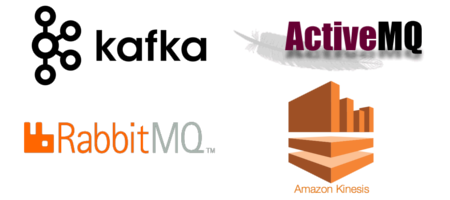

# DevOpsAndMore

++++++++++++++++++++ Messaging systems++++++++++++++++++++ 

[Introdution to Stream Processing](https://medium.com/stream-processing/what-is-stream-processing-1eadfca11b97)  
[Kafka Streams](https://www.confluent.io/blog/introducing-kafka-streams-stream-processing-made-simple/)  

1. Kafka
2. RabbitMQ
3. ActiveMQ

4. Apache Pulsar
5. IBM MQ

Cloud providers solutions:

6. AWS Kinesis
7. GCP Pub/Sub
8. Azure Event Hub
